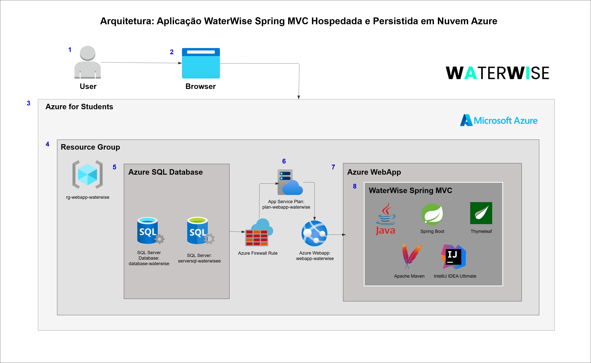

# Ecossistema WaterWise

"A enchente que alaga uma avenida pode começar com uma gota que o solo seco da zona rural não absorveu. Com WaterWise, cada metro de terra volta a ser uma esponja contra desastres."

## Visão Geral do Projeto

A **WaterWise** é um ecossistema tecnológico integrado que previne enchentes urbanas através do monitoramento inteligente de propriedades rurais.

### Repositório Principal
Para uma compreensão abrangente do projeto e sua arquitetura, acesse nosso repositório de overview:

**[WaterWise - Visão Geral do Projeto](https://github.com/WaterWise-GlobalSolution/waterwise-overview)**

## Organização GitHub

Para melhor organização dos entregáveis e centralização de todas as soluções do ecossistema WaterWise, criamos uma organização dedicada no GitHub.

### Acesse Nossa Organização
**[WaterWise Organization](https://github.com/WaterWise-GlobalSolution)**

---

# Sobre o WaterWise Admin
 
O projeto WaterWise Admin em Spring MVC, é um sistema com IoT integrado para monitoramento de propriedades rurais, baseado em Mairiporã-SP, e focado na prevenção de enchentes urbanas através do monitoramento da capacidade de retenção hídrica do solo.

O WaterWise Admin é uma solução completa que combina sensores IoT, inteligência artificial e análise de dados para:
- Monitorar a umidade e capacidade de absorção do solo
- Prevenir enchentes urbanas através do gerenciamento rural
- Fornecer relatórios inteligentes com IA
- Alertar sobre condições críticas em tempo real

## Sumário
- [Hospedagem na Nuvem Azure](#️hospedagem-na-nuvem-azure)
- [Tecnologias Utilizadas](#tecnologias-utilizadas)
- [Requisitos](#️requisitos)
- [Arquitetura](#arquitetura)
- [Dependências Principais](#dependências-principais)
- [Configuração da Infraestrutura no Azure](#️configuração-da-infraestrutura-no-azure)
  - [1. Criar Grupo de Recursos](#1-criar-grupo-de-recursos)
  - [2. Configurar o SQL Server](#2-configurar-o-sql-server)
  - [3. Configurar o Azure Web App](#3-configurar-o-azure-web-app)
- [Instruções de Como Executar a Aplicação](#instruções-de-como-executar-a-aplicação)
  - [1. Clone do Repositório](#1-clone-do-repositório)
  - [2. Verificação do Ambiente](#2-verificação-do-ambiente)
- [Build e Deploy](#build-e-deploy)
  - [Compilando o Projeto](#compilando-o-projeto)
  - [Realizando Deploy no Azure](#realizando-deploy-no-azure)
- [Acessando a Aplicação](#acessando-a-aplicação)
- [Gerenciamento do Banco de Dados](#gerenciamento-do-banco-de-dados)
- [Vídeo Explicativo e Demonstrativo](#vídeo-explicativo-e-demonstrativo)
- [FIAP: Global Solution](#fiap-global-solution)
- [Desenvolvedores](#desenvolvedores)
- [Licença](#licença)
 
## Hospedagem na Nuvem Azure
 
Toda a infraestrutura do projeto está hospedada na nuvem Azure utilizando serviços como Azure Web App e SQL Database.
 
## Tecnologias Utilizadas

- **Backend**: Java 17, Spring Boot  
- **Banco de Dados**: SQL Server (Azure SQL Database)  
- **IDE**: IntelliJ IDEA Ultimate  
- **Hospedagem**: Azure Web App  
- **Build e Deploy**: Maven, Azure CLI  
- **OAuth2 Client** - Autenticação via Google OAuth2

## Requisitos

- Java 17
- Maven  
- Azure CLI  
- Conta Azure (recomendada Azure for Students)  
- Git  
- IntelliJ IDEA Ultimate  

## Arquitetura



 
## Dependências Principais
 
O arquivo `pom.xml` contém as dependências necessárias para o projeto:
 
- **Spring Boot Starter Web**: Para criar a aplicação web
- **Spring Boot Starter Data JPA**: Para acesso a dados com JPA
- **Microsoft SQL Server Driver**: Para conexão com o SQL Server
- **Azure WebApp Maven Plugin**: Para facilitar o deploy no Azure através do IntelliJ IDEA Ultimate
- **Spring Boot Starter Thymeleaf**: Para templates HTML
 
## Configuração da Infraestrutura no Azure
Dentro da Azure, no Cloud Shell, efetua-se os seguintes comandos:
 
### 1. Criar Grupo de Recursos
 
```bash
az group create --name rg-webapp-waterwise --location eastus2
```
 
### 2. Configurar o SQL Server
 
```bash
# Criar SQL Server
az sql server create --resource-group rg-webapp-waterwise --name serversql-waterwise --location eastus2 --admin-user sqladmin --admin-password Fiap@2ds2025
 
# Criar a base de dados
az sql db create --resource-group rg-webapp-waterwise --server serversql-waterwise --name database-waterwise --service-objective S0
 
# Configurar regras de firewall (permitir todos os IPs)
az sql server firewall-rule create --resource-group rg-webapp-waterwise --server serversql-waterwise --name AllowAllIps --start-ip-address 0.0.0.0 --end-ip-address 255.255.255.255
```
 
### 3. Configurar o Azure Web App
 
```bash
# Criar plano de serviço
az appservice plan create --name plan-webapp-waterwise --resource-group rg-webapp-waterwise --sku F1
 
# Criar o Web App
az webapp create --resource-group rg-webapp-waterwise --plan plan-webapp-waterwise --name webapp-waterwise
 
# Configurar string de conexão com o banco de dados
az webapp config connection-string set --resource-group rg-webapp-waterwise --name webapp-waterwise --settings "DefaultConnection=Server=tcp:serversql-waterwise.database.windows.net,1433;Initial Catalog=database-waterwise;Persist Security Info=False;User ID=sqladmin;Password=Fiap@2ds2025;MultipleActiveResultSets=False;Encrypt=True;TrustServerCertificate=False;Connection Timeout=30;" --connection-string-type SQLAzure
```
 
## Instruções de Como Executar a Aplicação  
 
### 1. Clone do Repositório
 
```bash
git clone https://github.com/WaterWise-GlobalSolution/waterwise-devops.git
```
 
### 2. Verificação do Ambiente
 
Certifique-se de ter Java 17 e Maven instalados e configurados:
 
```bash
java --version
mvn --version
```
 
## Build e Deploy
 
### Compilando o Projeto
 
```bash
mvn clean package
```
 
### Realizando Deploy no Azure
 
```bash
mvn azure-webapp:deploy
```
 
## Acessando a Aplicação
 
Após o deploy, a aplicação estará disponível em:
 
- **Login**: [https://webapp-odontofast.azurewebsites.net/login](https://webapp-waterwise.azurewebsites.net/login)
 
## Gerenciamento do Banco de Dados
 
Para acessar e gerenciar o banco de dados diretamente no Azure:
 
1. Acesse o portal do Azure
2. Navegue até o grupo de recursos `rg-webapp-waterwise`
3. Selecione o banco de dados `database-waterwise`
4. Use o "Editor de Consultas" no menu lateral
5. Insira as credenciais:
   - Usuário: `sqladmin`
   - Senha: `Fiap@2ds2025`

## Vídeo Explicativo e Demonstrativo
[Clique aqui](https://www.youtube.com/watch?v=5g78-6TMEm0)
 
## FIAP: Global Solution
A cada semestre desenvolvemos um projeto que integra todas as disciplinas do curso, com o objetivo de propor soluções para um tema de relevância global, promovido pela nossa instituição de ensino (FIAP).

**Global Solution - Tema:** Prevenindo Eventos Extremos
da Natureza por meio da Tecnologia

O tema "Prevenindo Eventos Extremos da Natureza por meio da Tecnologia", proposto pelo projeto Global Solution da FIAP, convida os alunos a desenvolverem soluções inovadoras que utilizem tecnologia para enfrentar os desafios causados por fenômenos naturais intensos, como enchentes, terremotos, secas e ondas de calor. A proposta é transformar esses cenários críticos em oportunidades de inovação, aprendizado e impacto social, aplicando conhecimentos técnicos e criativos para proteger vidas, o meio ambiente e prevenir desastres ainda maiores.

**Instituição de Ensino:** FIAP - Faculdade de Informática e Administração Paulista

**Turma:** 2TDSPS

## Desenvolvedores

[Felipe Amador](https://github.com/felipetosma) | 553528

[Leonardo Oliveira](https://github.com/leodascripto) | 554024

[Sara Sousa](https://github.com/sousa-sara) | 552656

## Licença

Desenvolvido para o case de Mairiporã-SP como solução de prevenção a enchentes urbanas através do monitoramento de propriedades rurais.

---

**WaterWise** © 2025 - Sistema Inteligente de Prevenção a Enchentes
